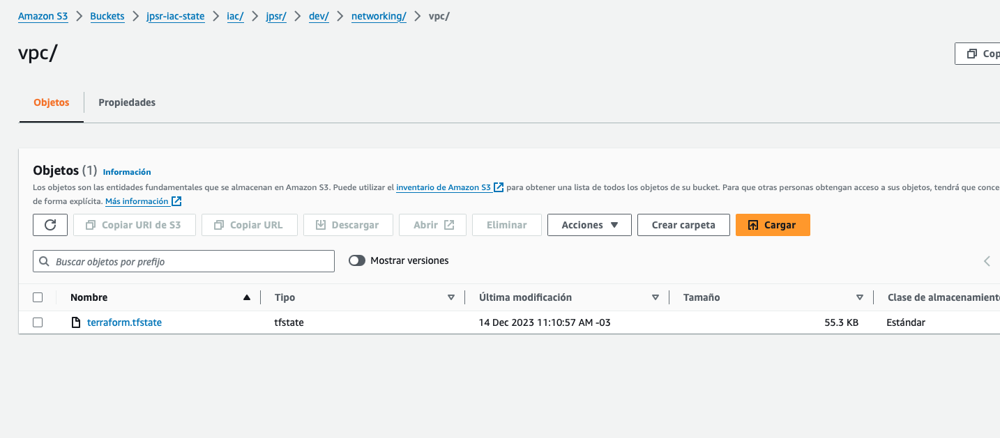

[<< Volver al inicio](../README.md)
# IaC


## Servicios
A continuación se presenta el listado de servicios habilitados con IaC

|Servicio|Descripción|Directorio|URL| 
|---|---|---|---|
|S3| Bucket para archivos estaticos   | `platform/s3/shorter-url-redirects`|[Enlace](https://aws.com)|  
|ECR| Repositorio para imagenes backend   | `platform/ecr/ecs-images`|[Enlace](https://aws.com)|  
|ECR| Repositorio para imagenes frontend   | `platform/ecr/ecs-images-front`|[Enlace](https://aws.com)|  
|ALB| Application load balancer de backend   | `platform/networking/alb/backend`|[Enlace](https://aws.com)|  
|ALB| Application load balancer de frontend   | `platform/networking/alb/frontend`|[Enlace](https://aws.com)|  
|VPC| VPC general del proyecto   | `platform/networking/vpc`|[Enlace](https://aws.com)|  
|ECS| Cluster para aplicaciones backend  | `platform/ecs/backend`|[Enlace](https://aws.com)|  
|ECS| Cluster para aplicaciones frontend  | `platform/ecs/frontend`|[Enlace](https://aws.com)| 
|ECS Service| Servicio para aplicaciones backend  | `platform/ecs/backend-app`|[Enlace](https://aws.com)|
|ECS Service| Servicio para aplicaciones frontend  | `platform/ecs/frontend-app`|[Enlace](https://aws.com)| 

## Estructura

Todo el contenido de IaC se encuentra bajo la carpeta `platform` y tiene una estructura similar al siguiente ejemplo: 

```
platform
    - service 1
        - component
            <> terragrunt.hcl
            <> vars.yaml
    - service 2
        - component
            <> terragrunt.hcl
            <> vars.yaml
        - component
            - terragrunt.hcl
            - vars.yaml
    - modules
        - module 1 (with terraform)
        - module 2 (wuth terraform)
    <> all_envs.yaml
    <> common_vars.yaml
    <> regions.hcl
    <> terragrunt.hcl

```

Siendo el detalle de estos de la siguiente forma:
- **Componentes**: Se agrupar en base a servicios y nombre (u objetivo) del componente a crear, permitiendo organizar de mejor manera los archivos a utilizar.
- **Manejo de variables**: Cada componente de IaC cuaenta con dos archivos:
    - terragrunt.hcl: Componente principal de terragrunt para indicar el origen del módulo, dependencias y archivos de variables.
    - vars.yaml: Acá se dejan todas las variables del componente en formato YML
- **Manejo de variables globales**: Estas se gestionan en distintos archivos como los siguientes.
    - all_envs.yaml
    - common_vars.yaml
    - regions.hcl
    - terragrunt.hcl

## Manejo de estados (tfstate)

Para el correcto manejo de estados de la infraestructura, se utiliza un **bucket de S3** el cual se configura de la siguiente forma:

```
remote_state {
  backend = "s3"
  generate = {
    path      = "backend.tf"
    if_exists = "overwrite_terragrunt"
  }
  config = {
    bucket = "jpsr-iac-state"
    region = "us-east-2"
    dynamodb_table = "my-lock-table"
    key = "${local.all_envs.project_folder}/${local.all_envs.project_name}/${local.common_vars.env}/${path_relative_to_include()}/terraform.tfstate"

  }
}
```

Importante a considerar, que cada componente tendrá su directorio especifico en base a la configuración del campo `key`, quedando como el siguiente ejemplo:




## Deseables o ToDo
- Agregar valores a variables usando outputs de dependencias.
- Crear pipeline de IaC para lanzar terragrunt mediante Github actions
- Eliminar carpeta `platform/modules` y ocupar repositorios privados dentro de la organización