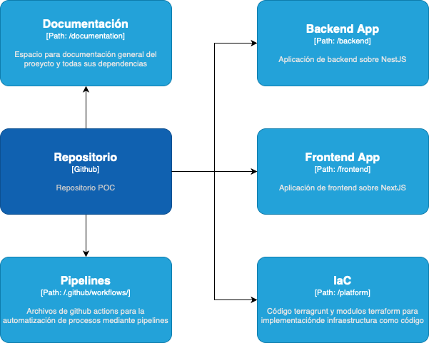
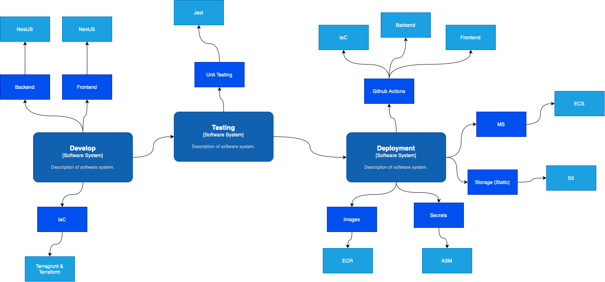

# SHORT URL APPLICATION

Este proyecto contempla la creación de una aplicación que permite acortar urls usando AWS como proveedor cloud, NestJS como stack para backend y NextJS para frontend.

Este repositorio es una POC con esta funcionalidad, la cual incluye las funcionalideds E2E asi como la habilitación de infraestructura mediante IaC, por lo cual, para poder facilitar la lectura de este repositorio, se puede entender como está organizado en base a la siguiente referencia:

## Secciones de documentación
- [Documentación del proyecto](project/README.md)
- [Documentación de IaC](IaC/README.md)
- [Documentación de Pipelines](pipelines/README.md)

## Ciclo de desarrollo

El proceso de desarrollo contempla la siguiente estructura

- Aplicaciones
    - Frontend: NextJS
    - Backend: NestJS
- Habilitación: 
    - IaC: Terragrunt y Terraform
- CI/CD
    - Github actions

De esta forma, a modo alto nivel, se representa el ciclo de desarrollo usado en esta POC en base al siguiente diagrama:

## Ideas generales considerar
- Se usa S3 como una herramienta más económica para el almacenamiento de archivos, con un tiempo de respuesta optimo para acceder a sus documentos y que puede ser configurable como políticas la eliminación de objetos pasado X tiempo.
- Al ser una POC, en cada documentación contaremos con un apartado de "Deseables" o "ToDo" para indicar mejores aplicables a la solución.

