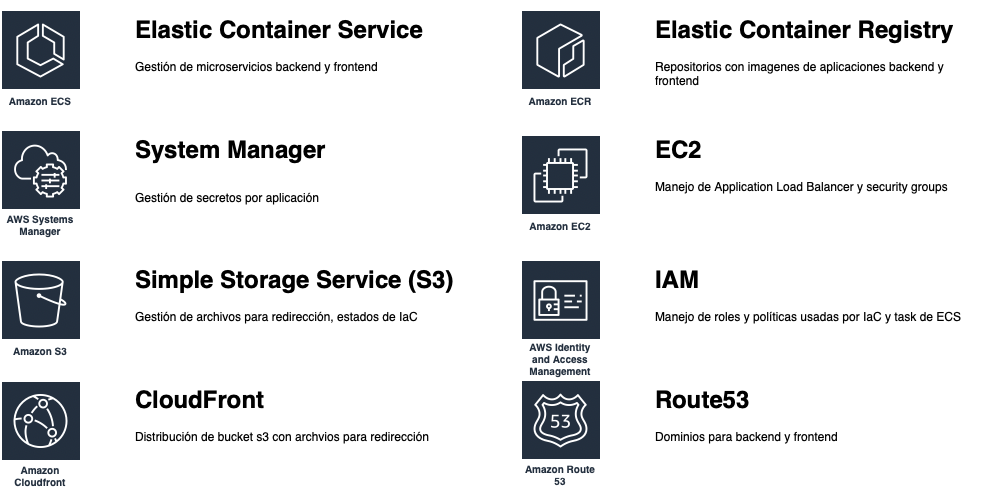
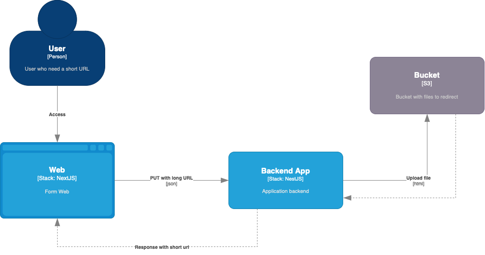
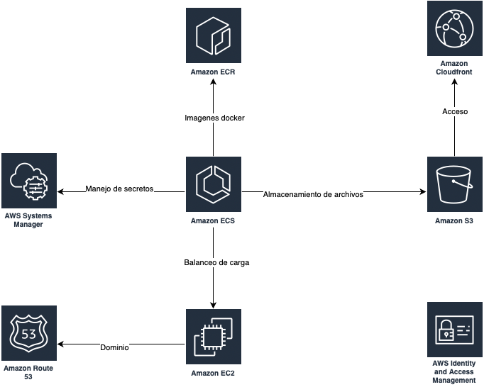
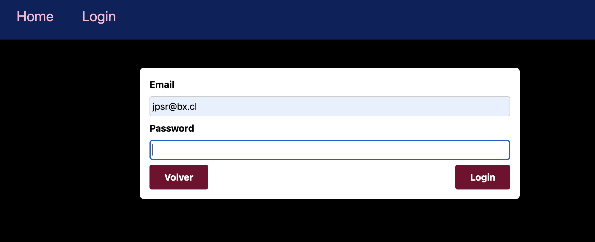
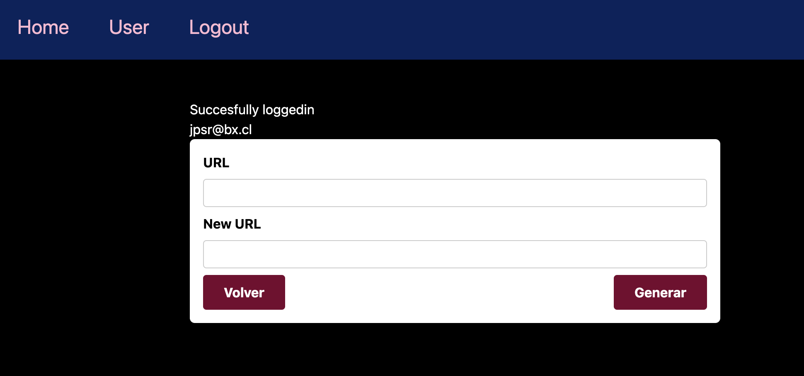
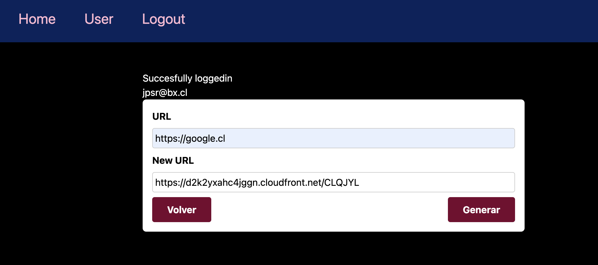
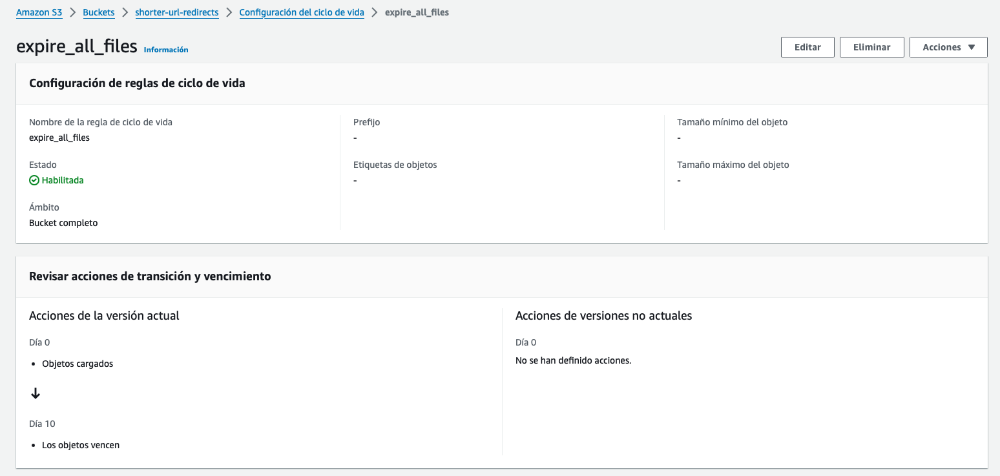
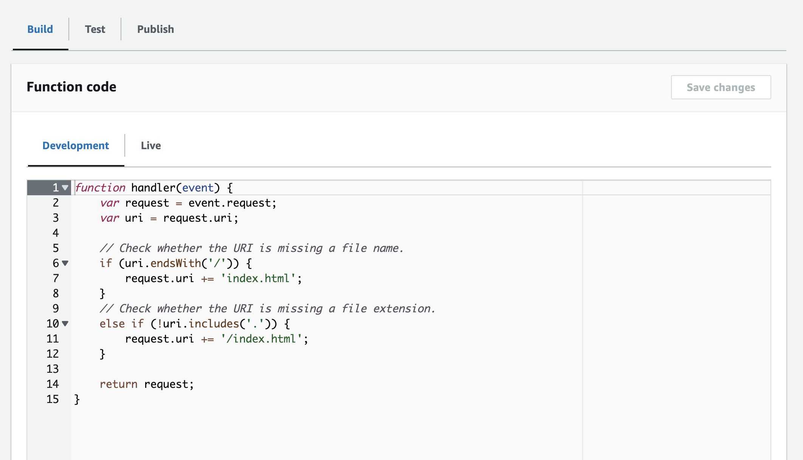

[<< Volver al inicio](../README.md)
# Proyecto

Este proyecto contempla una solución sobre servicios de AWS para acotar URLs. Siendo los siguientes, los principales servicios a utilizar:




## General 
Este proyecto contempla 3 grandes elementos: 
- Backend
- Frontend
- S3 Redirect

### Backend
El servicio de backend contempla una aplicación en NestJS la cual mediante una llamada PUT recibe un objeto de la forma:

```
{
    url: "https://some-url.com"
}
```

Y devuelve un mensaje de la forma:

```
{
    url: "https://some-url.com",
    newUrl: "https://another-url.com/XXYYZZ"
}
```

Para lograr esto, el servicio de backend funciona de la siguiente manera:



Cuando llega una llamada a la API, este genera un archivo html con un código de redirección, este es almacenado en S3 de la forma `XXYYZZ/index.html` siendo esto:
- XXYYZZ: Carpeta con el nombre generado por la API.
- index.html: Archivo que incluye la redirección.

Una idea general de los servicios involucrados en este proceso, se pueden visualizar en la siguiente imagen:




Más información en [Backend](backend/README.md)

### Frontend

La aplicación de frontend se encuentra ejecutada en una instancia ECS usando NextJS.

Cuando se ingresa a esta web requiere un inicio de sesión para poder acceder a la funcionalidad de acortar urls.



Una vez iniciada sesión, nos permitira acceder a la vista principal:



Con la cual, luego de ingresar una URL valida, nos genera la nueva url:



Más información en [Frontend](frontend/README.md)


### S3 
Todos los archivos con la redirección HTML y la URL de destino se encuentran almacenados en el bucket de S3 llamado `shorter-url-redirects`, el cual fue creado con IaC. 

Este bucket tiene una regla donde cada archivo es **eliminado de forma automática luego de 10 días de creado**, esto con el fin de limpiar disminuir la cantidad de archivos disponibles con un enlace que ya no será usado. Esto es configurable mediante IaC sobre el componente `/platform/s3/shorter-url-redirects/...`.



Adicionalmente, se considera cloudfront para acceder a los archivos de este bucket. Sin embargo, como se utilizan subdirectorios para cada url generada, las configuraciones propias de cloudfront no permiten acceder al archivo `index.html` de forma predeterminada, por lo que se crea una función en cloudfront que nos permite acceder al archivo por defecto en cualquier subdirectorio.




## Pipelines

Para la automatización de los sistemas contamos con pipelines que nos permiten desplegar aplicaciones o infraestructura usando Github Actions.

Más información sobre los pipelines en la sección [Pipelines](../pipelines/README.md)

## Deseables o ToDo
- Agregar un dominio a `cloudfront` para una url más corta (falta generar certificado)
- Configuración de `route53` mediante IaC
- Agregar proceso de CI a pipelines (actualmente solo CD)
- Hooks para desarrollo en ambiente local (estandarización de código, commits, testing, etc)
